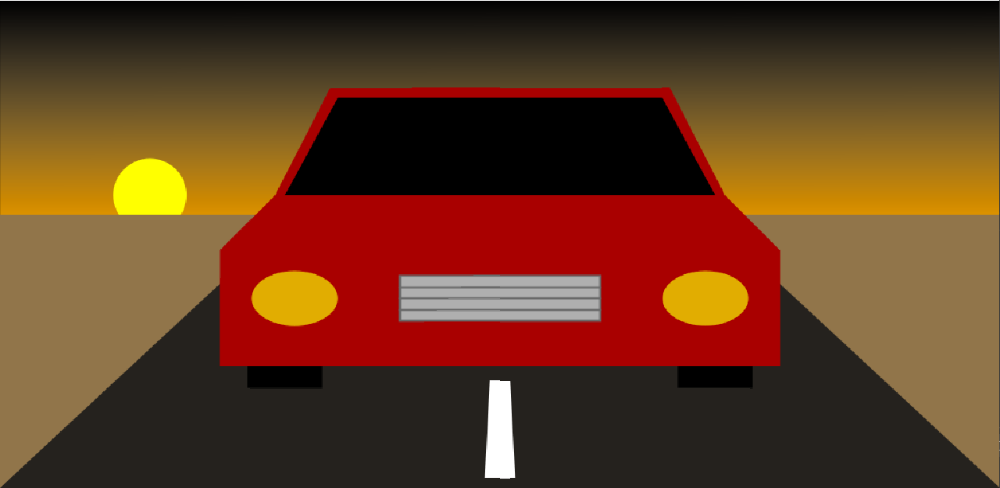

# Music Visualiser Project

Name: Janae Fariñas

Student Number: C19708735

# Description of the assignment
"Something beautiful while listening to music"

This assignment is a visual art piece based on the music "Crash My Car" by COIN. The scenes in this project create a story about taking a road trip during the night.

# Instructions
- Run the code
- Press the spacebar to start the music and play the scene
- Press keys 1-3 to change scenes
- Press spacebar again to restart the music and reset the scenes

# How it works
The keys 1-3 are used to choose which scene to display.

The first scene is a car driving down the road at sunset. The second scene is a close up of the spinning wheel of the car as it is driving. The third scene is set at night where the northern lights can be seen in the sky.

Each object is drawn using different shapes. To give the imagery more depth it is drawn in perspective. Some objects are translated to move left and right by changing the x-value, or up and down by changing the y-value. This creates an illusion that the object is physically in motion.

# What I am most proud of in the assignment
I am most proud of how the sky looks for key 1. I made two different looking skies, one for sunset and one for night. I used a [video](https://www.youtube.com/watch?v=tIgLJz0ZQD4) on YouTube as a reference to create a color gradient for the sky. It uses a for loop to draw multiple horizontal lines and uses the index to gradually change the stroke color for each line. This creates a smooth gradient where the lines start off as black and fade to color from top to bottom.

```Java
// Night Sky
c1 = PApplet.map(210, 0, 360, 0, 255);
c2 = PApplet.map(270, 0, 360, 0, 255);
c = PApplet.map(jf.getSmoothedAmplitude(), 0, 1, c1, c2);
b = jf.getSmoothedAmplitude();

for (int i = 0; i < (int) halfH; i++) {

    jf.stroke(c, i * c, i * b);
    jf.line(0, i, jf.width, i);
}
```

In the video, they used RGB colors but I used HSB colors for my code. I felt it would be easier to choose the colors that I wanted and I would just need to change the saturation and brightness to create the gradient effect. I experimented with the code by using different variables to control the HSB values and it created different kinds of gradients. I compared the results with real life images of the sky during sunset and during the night and altered the code it to make it look as close to the image as possible. I also added small details like the sun, the moon and the stars which move through the sky to make it look more realistic.

I think this part of the assignment fits well with the theme of *something beautiful while listening to music*.

# Results

## Screenshots

Scene 1


Scene 2


Scene 3


Scene 4


## Video

[](https://www.youtube.com/watch?v=dvg4vXOE_-A)